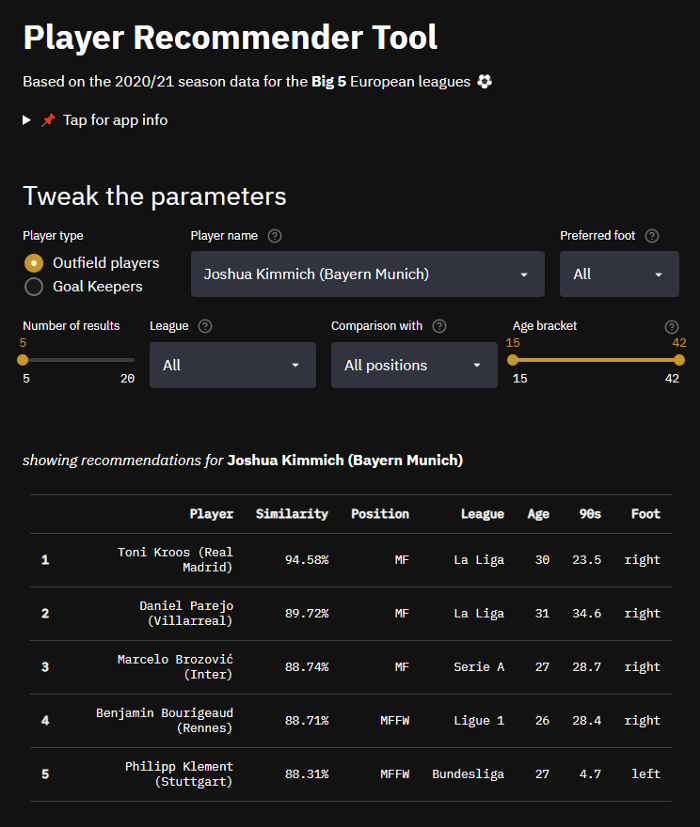

# Player Recommender Tool :soccer:

### Search for similar players in the Big 5 European leagues. Try it out [here](https://share.streamlit.io/avneeshafc/player_recommender/app.py)

:bar_chart: Data credits: [FBref](https://fbref.com/en/) / [StatsBomb](https://statsbomb.com/). All units per 90.

_**Outfield players dataset**_ - Total number of players : **2040**. Features for each player : **164**. Minimum 90s played : **3**.

_**Goal-keepers dataset**_ - Total number of players : **173**. Features for each player : **40**. Minimum 90s played : **1.5**.

:heavy_exclamation_mark: :bulb: **Note:** The similarity values are totally based on the **statistical output of players**, in this case 40 statistical features for GK's and 164 features for outfield players. The similarity values are not probabilities but resemble more to percentiles (cosine distances normalized to the range 0 to 100).

:snake: Principal Component Analysis (PCA) was used for dimensionality reduction. The detailed blog covering the entire lifecycle of the project in detail including data preprocessing, exploratory data analysis and approach used for building the recommendation engine is available [here](https://medium.com/@iAvneesh/building-a-player-recommender-tool-666b5892336f).

:earth_asia: Reach out to me on [Twitter](https://twitter.com/iAvneesh). Also check out my sports analytics work [here](https://twitter.com/ThirdRuns).
